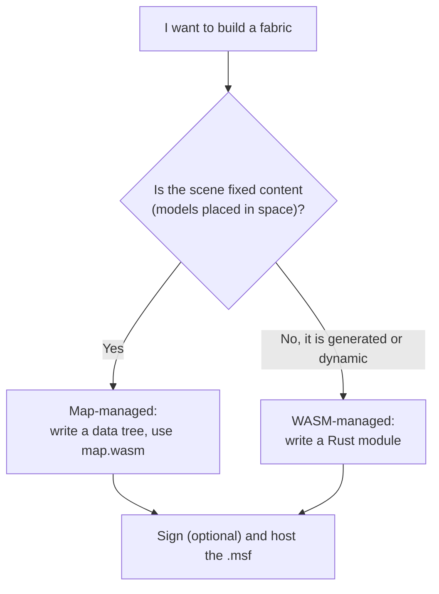
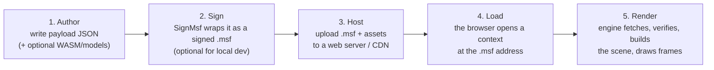

# Authoring Spatial Fabrics

This guide is for **content authors** — the people who build the 3D spaces the engine renders. Where the other guides are about the engine itself (how to embed it, how to build it), this one is about the thing the engine *loads*: a **spatial fabric**. If you have ever written an HTML page for a web browser, this is the same idea for a 3D browser. You write a file, put it on a web server, and the browser fetches it and turns it into a live, navigable place. That file is the fabric.

This page is the map of the whole authoring section. It defines what a fabric is, walks through the pipeline from "text file on your disk" to "world on the screen," explains the two very different ways you can describe a scene, gives you an honest list of what actually works today, and points you at the deeper how-to pages that follow. Read it top to bottom first; every later page assumes the vocabulary introduced here.

Everything in this section reflects **what the engine does right now**, verified against the source code. Where a feature is parsed but not yet wired up, or is a placeholder, this section says so plainly rather than pretending it works. Building against a feature that does not exist yet is the most expensive mistake an author can make, so the limitations are called out as loudly as the capabilities.

---

## Why fabrics exist

A metaverse browser needs an answer to one question: *given an address, what do I show?* A web browser answers it with HTML — a document format that any server can host and any browser can parse. A spatial browser needs the same thing for 3D: a portable, self-describing, hostable file that says "here is a place, here is what is in it, and here is the code that brings it to life." That file is the **MSF** — the Metaverse Spatial Fabric.

The design has three goals, and they explain almost every decision you will meet later:

1. **Portable.** A fabric is a plain file you can host on any ordinary web server or CDN. The engine fetches it over HTTPS like a browser fetches a page. There is no special server software.
2. **Self-describing.** A fabric names its own identity, the code modules it needs, and (optionally) the scene it contains — all in one document. The engine does not need out-of-band configuration to load it.
3. **Verifiable.** Because a fabric can run sandboxed code and represent a real place, authorship matters. A fabric can be cryptographically **signed** so the engine (and the person using it) can tell who published it. Signing is optional for local testing but is the intended path for anything real.

---

## What a fabric actually is

A fabric is a single **MSF file**. At its heart is a **JSON payload** — an ordinary JSON object with a small set of known fields. That payload can be delivered two ways:

- **As plain JSON** — the file *is* the JSON object. The engine loads it, but there is no signature, so it carries only a synthetic, untrusted identity. This is the fast path for local experimentation.
- **As a signed JWS** — the JSON payload is wrapped in a **JSON Web Signature** (compact form: `header.payload.signature`) that also carries the author's X.509 certificate chain. The engine can verify the signature and read the publisher's identity from the certificate. This is the intended path for published fabrics.

Either way, the author-facing content is the same JSON payload. Here is the smallest fabric that loads — a plain-JSON file with nothing but an identity:

```json
{
   "container": "my-first-space",
   "services": [],
   "modules": []
}
```

That loads, but it is empty: no code, no scene. To make something appear you add one of two things — a `data` block (a scene written directly in JSON) or a `modules` entry (a code module that builds the scene). Those are the two authoring paths, and choosing between them is the biggest decision you will make.

### The payload fields

Every field a fabric payload can carry, and whether the engine uses it today:

| Field | Type | What it is | Status today |
|---|---|---|---|
| `container` | string | The fabric's identity name. Combined with the signer's certificate and the logged-in user, it scopes the fabric's storage and sandbox. | Used. |
| `modules` | array | The WASM code modules the fabric runs, each `{ "url", "hash" }`. | Used — fetched and run on load. |
| `data` | object | A general block the fabric carries for its modules; the *map-managed* scene tree lives at `data.scene`. | Used — `data.scene` is injected by the generic map module. |
| `primary` | object | The initial camera pose and background colour. Only honoured on the top-level fabric. | Used. |
| `services` | array | Declared external services the fabric wants to talk to. | **Parsed but not wired** — no runtime effect yet. |
| `successor` | string | A pointer to a newer version of the fabric. | **Parsed but not acted on.** |

Do not spend effort on `services` or `successor` yet — they are reserved for future connectivity and versioning work and have no runtime behaviour today. The three fields that make things happen are `modules`, `data`, and `primary`.

---

## The two authoring paths

There are exactly two ways to get geometry into a scene, and a given fabric uses one or the other. The engine calls these the *map-managed* and *WASM-managed* modes, and they are mutually exclusive per fabric.

### Path A — Map-managed: write the scene as JSON

You describe the whole scene as a tree of nodes in the payload's `data.scene` block. You do not write any code. Instead you point the fabric at a small, generic, pre-built module — `map.wasm` — whose only job is to ask the engine to read your `data.scene` tree and build the scene from it. This is the **static** path: the scene is fixed, described declaratively, and ideal for places assembled from 3D models (buildings, props, environments).

This is the path to start with. It is the fastest way to see something, it needs no build toolchain, and the [quickstart](authoring-first-fabric.md) uses it end to end. The full node schema is documented in [Static scenes: the data tree](authoring-static-scenes.md).

### Path B — WASM-managed: build the scene with code

You write a **WebAssembly module** (in practice, Rust compiled to `wasm32-unknown-unknown`) that builds the scene by calling the engine's scene-building functions one node at a time. The fabric's payload lists your module's URL; there is no `data` block. This is the **dynamic** path: your code runs in a sandbox and constructs the graph, so it can generate, parameterize, or vary the scene. The example solar system is built this way — hundreds of bodies emitted by code. This path is documented in [Dynamic scenes with WASM](authoring-dynamic-scenes.md).

### Which to choose



Rule of thumb: if you could describe your space by listing objects and where they go, use **map-managed**. If the space needs logic to come into being, use **WASM-managed**. Both paths produce the same kind of MSF file and load the same way.

---

## The pipeline: from text file to world on screen

Whichever path you take, the journey from your editor to the screen is the same five steps. Every later page is really just a detailed treatment of one of these steps.



1. **Author.** Write the payload JSON. For map-managed, that includes the `data` scene tree. For WASM-managed, you also build a `.wasm` module. You may also produce assets — GLB models, textures — that the fabric references by URL.
2. **Sign.** Run the `SignMsf` tool to wrap your payload as a signed `.msf`. This is optional for local testing (plain JSON loads), but it is how you stamp a fabric with a verifiable identity. Covered in [The MSF file and signing](authoring-msf-and-signing.md).
3. **Host.** Put the `.msf` file and every asset it references (models, textures, `.wasm` modules) somewhere the engine can fetch them over HTTPS. The test fabrics use a CDN; any static file host works.
4. **Load.** A host application opens a session pointed at your fabric's address. (How a host does that is the [embedding guide](embedding-sneeze.md)'s job; as an author you just need a running browser and your URL.)
5. **Render.** The engine fetches the MSF, verifies its signature, reads its identity, runs its modules or reads its `data` tree, fetches referenced assets, and composes the scene each frame.

---

## What actually renders today

Before you design anything, calibrate on what the engine can currently draw. The scene is built from a small set of object kinds, and each has specific, sometimes surprising, behaviour. The full catalogue with every field and rule is [Scene object reference](authoring-scene-reference.md); this is the orientation.

| You want... | Use | Notes |
|---|---|---|
| A building, prop, or any 3D model | a **physical** node with a GLB model URL | Self-contained `.glb` files render as real meshes. |
| A simple placeholder box | a **physical** node with **no** model, sized by its bounds | Renders as a grounded, auto-coloured box. |
| A planet, moon, or star | a **celestial** body node **plus** a **surface** child | A body node alone is invisible — the visible sphere is its `surface` child; a star also emits light. |
| Orbit paths | a celestial **system** node with orbit parameters | Drawn as tube-like trail curves. |
| A placed scene light | a **light** node (point or spot) | Colour and brightness are set per light; the light lives at a position in the scene. |
| Scene-wide ambient or sun (directional) light | the `primary` block | Global lighting is a property of the scene, not a node — see below. |
| An in-world UI panel | the WASM `Node_Panel` call | Panels can only be created from code, not from a JSON `data` tree. |
| The starting camera, sky colour, and global lighting | the `primary` block | Only the top-level fabric's `primary` is applied. |

The single most common surprise: **a planet or star node draws nothing by itself.** The visible, textured sphere is a separate `surface` child attached under the body. This is explained in detail in the reference, but it is worth knowing before you draw your first celestial scene.

---

## Honest limitations (read before you plan)

These are current, code-level constraints. They are not permanent design decisions — several are placeholders for work in progress — but building against them today will not work. Each is explained where it matters in the later pages; this is the consolidated warning.

- **`services` and `successor` do nothing yet.** They are parsed and stored but have no runtime effect. There is no external-service connectivity and no version-upgrade path today.
- **The integrity field is `hash`, not `comment-hash`.** Several example files in the repository use `"comment-hash"` on their module entries. The engine only reads `"hash"`. A `comment-hash` is silently ignored, so the module loads with **no** integrity check. Use `"hash"` if you want the check.
- **Signed content is not yet enforced.** The engine verifies signatures and chains, but it currently marks every MSF container's trust as *expired* regardless of the result, and it still loads untrusted and plain-JSON fabrics. Do not rely on trust level to gate anything yet.
- **GLB works; external glTF does not.** Self-contained `.glb` files (or glTF JSON with embedded buffers) render. A `.gltf` that references separate `.bin` or image files by relative path will not resolve those files. Ship `.glb`.
- **Textures only apply to celestial surfaces.** An image URL on a `surface` node textures its sphere. The same URL on a physical node is fetched but not sampled — physical models get their look from the GLB, and model-less boxes are auto-coloured.
- **Panels come from code only.** There is no JSON node type for a UI panel; a panel is created by a WASM module calling `Node_Panel`.
- **Modules run once, on open.** A module's `Open` function runs when the fabric loads. There is **no per-frame tick**. The `Timer` host functions and the `OnTimer` export exist but are stubs — the timer never fires. Anything you want in the scene must be created during `Open`.
- **Colour in a JSON `data` tree is awkward.** Node colour is stored as a float that actually holds a `0xRRGGBB` *bit pattern*, which is natural to set from code but unnatural to write as a JSON number. For map-managed scenes, lean on GLB model colours and the automatic box colouring rather than hand-setting `fColor`.

---

## Where to go next

The rest of this section is a guided path. If you are new, follow it in order.

1. **[Your first fabric](authoring-first-fabric.md)** — the fastest end-to-end walkthrough: a tiny map-managed scene with one model, signed and loaded. Start here.
2. **[The MSF file and signing](authoring-msf-and-signing.md)** — the full payload schema, plain JSON versus signed JWS, the trust model, and every `SignMsf` command.
3. **[Static scenes: the data tree](authoring-static-scenes.md)** — the complete JSON node schema for map-managed fabrics, with nesting, child fabrics, and worked examples.
4. **[Dynamic scenes with WASM](authoring-dynamic-scenes.md)** — writing a Rust module that builds the scene: the toolchain, the lifecycle, and the node-building calls.
5. **[Scene object reference](authoring-scene-reference.md)** — every object kind the engine draws, what fields it reads, and exactly what appears.
6. **[WASM host API for content](authoring-wasm-host-api.md)** — the complete list of functions a module can call: console, storage, scene, and timer.

---

## See also

- [Embedding Sneeze](embedding-sneeze.md) — how a host application opens a session at your fabric's address (the consumer side of what you author).
- [MSF system](../systems/msf.md) · [Scene system](../systems/scene.md) · [WASM system](../systems/wasm.md) — the engine internals behind fabric loading, the scene model, and the sandbox.
- [Container system](../systems/container.md) — how a fabric's identity scopes its storage and sandbox.

---

[Home](../Home.md) · Prev: [Guides](index.md) · Next: [Your first fabric](authoring-first-fabric.md)
