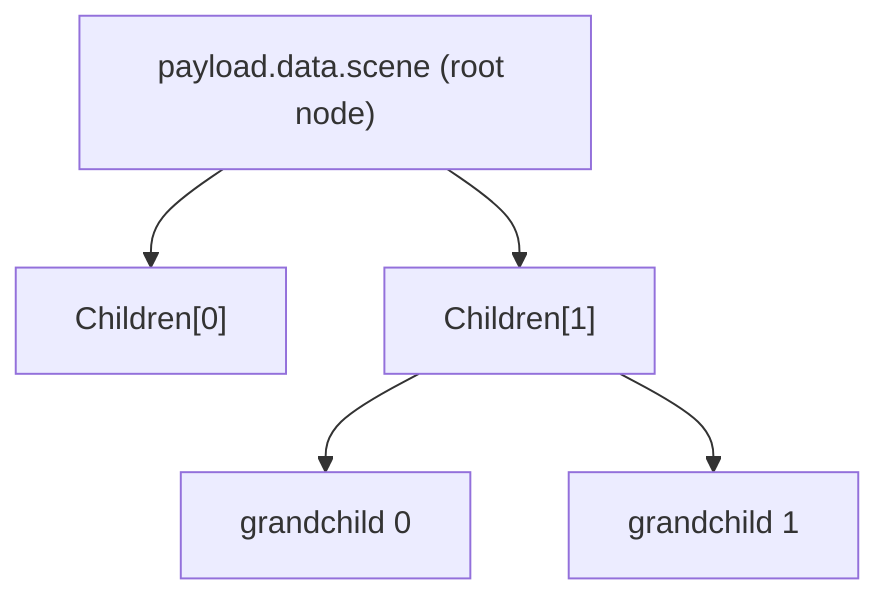

# Static Scenes — The Data Tree

This page is the complete reference for the **map-managed** authoring path: describing an entire scene as a JSON tree in your fabric's `data.scene` block, with no code to write. It documents every field of every node, how nodes nest and inherit transforms, how to attach other fabrics as children, and it walks through a full, buildable example. If you followed the [quickstart](authoring-first-fabric.md), this is the page that explains everything the quickstart glossed over.

Map-managed scenes are the right choice for fixed content — spaces you assemble by placing models and props at known positions. If your scene needs code to come into being, use [dynamic scenes](authoring-dynamic-scenes.md) instead.

---

## How the data tree becomes a scene

The payload's `data` field is a general-purpose block: a read-only bag of JSON that ships inside the fabric for its modules to use however they like. The map-managed path claims one corner of it. You put your scene tree at `data.scene`, and you list the generic `map.wasm` module in `modules`. When the fabric loads, that module runs its `Open` function, which makes exactly one call — `Node_Map`, passing the path `"scene"` — that tells the engine: "read this fabric's `data.scene` object and build it." The engine then reads `data.scene` itself as the **root** node and creates it, walks the root's `Children` array creating each child under the root, then recurses into each child's `Children` down to the bottom of the tree.

So the `data.scene` object is simultaneously your root node *and* the container for the whole tree, while the rest of `data` is yours to fill with whatever else your fabric needs. Parentage is entirely positional: a node's parent is whatever node it is nested inside. You never write a parent reference — the engine derives it from the nesting and, in fact, ignores any parent id you try to supply.



If you put a tree at `data.scene` but forget the `map.wasm` module, nothing happens — the module is what triggers the injection. That is the single most common "my scene is blank" cause. (The `"scene"` location is `map.wasm`'s own hardcoded contract, not an engine rule: `Node_Map` accepts any dot-separated path into `data`, and an empty path would read the whole `data` block as the tree.)

---

## Anatomy of a node

Every node is a JSON object. All fields are optional except that a node needs enough to be meaningful (an id, and usually a bound or a model). Here is the full set the engine reads, with defaults:

| Field | Shape | Default | What it does |
|---|---|---|---|
| `Head` | `{ "Self", "Event" }` | — | Node identity. `Self` is a `"<letter>-<index>"` id (or a raw composed integer); `Event` is a user tag (default 0). A `Parent` field, if present, is ignored. |
| `Name` | string | empty | Display name. Up to 48 characters; ASCII is safest (stored as 16-bit code units). |
| `Type` | `{ "bType", "bSubtype", "bFiction" }` | all 0 | Sub-classifies the node. `bType` selects the specific kind within a class (e.g. which celestial body, or which light); `bSubtype` = 255 marks a child-fabric attachment; `bFiction` is an author tag. |
| `Owner` | integer | 0 | An owner tag. Rarely needed. |
| `Resource` | `{ "qwResource", "sName", "sReference" }` | empty | External asset binding. `sReference` is the asset URL (GLB model, or celestial texture). `sName` is a label. Lengths are capped (see below). |
| `Transform` | `{ "Position", "Rotation", "Scale" }` | pos 0, rot identity, scale 1 | Placement **relative to the parent**. `Position` metres `[x,y,z]`; `Rotation` quaternion `[x,y,z,w]`; `Scale` `[x,y,z]`. |
| `Orbit` | `{ "tmPeriod", "tmOrigin", "dA", "dB" }` | all 0 | Orbital/animation parameters (celestial bodies and surface spin). See [scene reference](authoring-scene-reference.md). |
| `Bound` | `{ "Max": [x,y,z] }` | 0 | Extents in metres. For a physical box this is its size; for a celestial body `Max[0]` is its radius. A zero bound is invisible. |
| `Properties` | `{ "fMass", "fGravity", "fColor", "fBrightness", "fReflectivity" }` | all 0 | Physical/appearance scalars. `fColor` and `fBrightness` matter for celestial surfaces and lights; see the caveat below. |
| `Children` | array of nodes | none | Nested child nodes. |

### The id scheme (`Head.Self`)

An id is a **class letter**, a hyphen, and an **index number**:

| Letter | Class | Typical use |
|---|---|---|
| `R` | root | The single top node of the tree. |
| `C` | celestial | Stars, planets, moons, orbital systems, surfaces. |
| `T` | terrestrial | Ground/terrain-style objects. |
| `P` | physical | Models, props, boxes — most ordinary objects. |
| `L` | light | Scene lights. |

So `"P-1"` is physical object 1, `"C-12"` is celestial object 12, and so on. Indices must be unique across the tree; a duplicate composed id collides. (Panels have their own class but no letter here — they cannot be authored in a `data` tree; they are created only from code.)

You may instead give `Self` a raw integer if you are generating ids programmatically, but the letter form is what humans should write.

### Resource lengths — a real limit

`Resource.sReference` holds at most **127 usable characters**, and `Resource.sName` at most **63**. This matters: a long CDN URL with query strings can overflow 127 characters and be silently truncated, breaking the fetch. Keep asset URLs short — host assets on a path-friendly domain rather than passing long signed URLs.

### The colour caveat

`Properties.fColor` is stored as a floating-point number whose *bits* are interpreted as a `0xRRGGBB` colour. That is natural to set from code (`f32::from_bits(0x00RRGGBB)`) but unnatural to express as a JSON number — you would have to write the decimal value of the reinterpreted float. For map-managed scenes, avoid hand-setting `fColor`: physical models take their colour from the GLB, and model-less boxes are given an automatic colour derived from their id. Colour authoring is really a job for the [dynamic path](authoring-dynamic-scenes.md).

---

## Transforms compose down the tree

A node's `Transform` is relative to its parent, and transforms multiply down the hierarchy — exactly like a scene graph in any 3D tool. Move a parent and all its descendants move with it; rotate a parent and its children orbit around it. This is the mechanism you use to build and place sub-assemblies: group related objects under a node, position them relative to that node, then move the group as a unit.

Omitting `Transform` (or any of its three parts) uses the identity default: position `[0,0,0]`, rotation `[0,0,0,1]`, scale `[1,1,1]`. A node with no `Transform` sits exactly at its parent's origin.

---

## A complete worked example

Here is a small, fully buildable plaza: a root, a GLB statue, two model-less marker boxes placed to either side, and a point light overhead. Every node is annotated in the prose that follows.

```json
{
   "container": "plaza",
   "services": [],
   "modules":
   [
      { "url": "https://cdn.example/map.wasm", "hash": "" }
   ],
   "primary":
   {
      "camera": { "position": [-12, 0, 3], "rotation": [0, 0, 0, 1] },
      "background": "0b1020"
   },
   "data":
   {
      "scene":
      {
         "Head": { "Self": "R-0" },
         "Name": "Plaza",
         "Children":
         [
            {
               "Head": { "Self": "P-1" },
               "Name": "Statue",
               "Resource": { "sReference": "https://cdn.example/statue.glb" },
               "Transform": { "Position": [0, 0, 0] },
               "Bound": { "Max": [1, 1, 2] }
            },
            {
               "Head": { "Self": "P-2" },
               "Name": "Marker Left",
               "Transform": { "Position": [0, 4, 0] },
               "Bound": { "Max": [0.5, 0.5, 0.5] }
            },
            {
               "Head": { "Self": "P-3" },
               "Name": "Marker Right",
               "Transform": { "Position": [0, -4, 0] },
               "Bound": { "Max": [0.5, 0.5, 0.5] }
            },
            {
               "Head": { "Self": "L-1" },
               "Name": "Key Light",
               "Type": { "bType": 3 },
               "Transform": { "Position": [-4, 0, 8] },
               "Properties": { "fBrightness": 5.0 }
            }
         ]
      }
   }
}
```

Reading it top to bottom:

- **`R-0` (root)** is the frame everything hangs under. It has no geometry of its own — it is the anchor for the group.
- **`P-1` (statue)** points at a GLB with `Resource.sReference`, so it renders as that model. Its `Bound` is a sensible fallback size in case the model fails to load. `Position [0,0,0]` places it at the root's origin.
- **`P-2` and `P-3` (markers)** have no `Resource`, so each renders as an automatically coloured box sized by its `Bound` — half-metre cubes, placed four metres to either side of the statue along Y.
- **`L-1` (light)** is a light node. `Type.bType` = 3 selects a **point** light; `fBrightness` sets its intensity; it is placed eight metres up (+Z) and four toward the camera (-X) to key-light the statue. A point light is omnidirectional, so only its position matters. (Light types and colours are detailed in the [scene reference](authoring-scene-reference.md).)
- **`primary`** starts the camera twelve metres back along -X and three up (+Z), looking along +X at the group, on a near-black sky.

Sign it (or load it as plain JSON) and you have a lit plaza with one real model and two placeholder markers.

---

## Attaching another fabric as a child

A node can stand in for **another whole fabric**, letting you compose large spaces from independently authored pieces (a building fabric dropped into a city fabric, for example). You mark a node as an attachment point by setting its `Type.bSubtype` to **255** and putting the child fabric's `.msf` URL in `Resource.sReference`. When the engine reaches such a node, instead of treating it as ordinary geometry it **spawns the referenced fabric** at that node's place in the tree, inheriting its transform.

```json
{
   "Head": { "Self": "P-9" },
   "Name": "Museum Wing",
   "Type": { "bSubtype": 255 },
   "Resource": { "sReference": "https://cdn.example/museum.msf" },
   "Transform": { "Position": [20, 0, 0] }
}
```

An attachment node's own inline `Children` are not used — the child fabric supplies its own contents. This is how you keep fabrics modular: author each place once, host it, and reference it from as many parent fabrics as you like.

---

## Generating a data tree from an export

Hand-writing large trees is tedious. The repository includes `tools/ConvertDfw/convert_dfw.py`, a small, readable Python converter that turns a foreign "spatial2" scene export into a Sneeze MSF JSON document with a ready-to-inject `data.scene` tree. Even if you never use its specific input format, its source is the clearest worked reference for the node schema — it documents, in its header comment, exactly the fields described on this page and shows how nesting, attachments (`bSubtype` 255), and asset-path rewriting map onto them. If you are writing your own exporter from some other authoring tool, start by reading that script.

```bash
python tools/ConvertDfw/convert_dfw.py export.json \
   --container my-space \
   --module-url https://cdn.example/map.wasm \
   --module-hash sha256-<hex> \
   --asset-base https://cdn.example/assets \
   -o my-space.msf.json
```

It writes a payload JSON (the `data.scene` tree plus the `container`/`modules` wrapper) that you then sign with `SignMsf`.

---

## Gotchas checklist

- **No `map.wasm`, no scene.** A tree at `data.scene` without the map module in `modules` is inert.
- **Zero bounds are invisible.** A model-less node needs a non-zero `Bound.Max`; so does anything relying on the box fallback.
- **GLB only.** `Resource.sReference` must point at a self-contained `.glb` (or glTF with embedded buffers). External `.bin`/image references will not resolve.
- **URLs are length-limited.** `sReference` truncates past 127 characters; keep asset URLs short.
- **Textures are for celestial surfaces, not physical nodes.** An image URL only textures a celestial `surface`; on a physical node it does nothing visible.
- **Colour is impractical in JSON.** Rely on GLB colours and automatic box colouring rather than `fColor`.
- **Panels cannot be authored here.** In-world UI panels exist only via the WASM `Node_Panel` call.

---

## See also

- [Scene object reference](authoring-scene-reference.md) — what each node kind actually draws, and every `Type`/`Bound`/`Orbit`/`Properties` value it reads.
- [Dynamic scenes with WASM](authoring-dynamic-scenes.md) — the code path, for scenes a static tree cannot express.
- [The MSF file and signing](authoring-msf-and-signing.md) — wrapping this payload into a signed fabric.
- [Scene system](../systems/scene.md) — the engine's scene model behind the data tree.

---

[Home](../Home.md) · Prev: [The MSF file and signing](authoring-msf-and-signing.md) · Next: [Dynamic scenes with WASM](authoring-dynamic-scenes.md)
